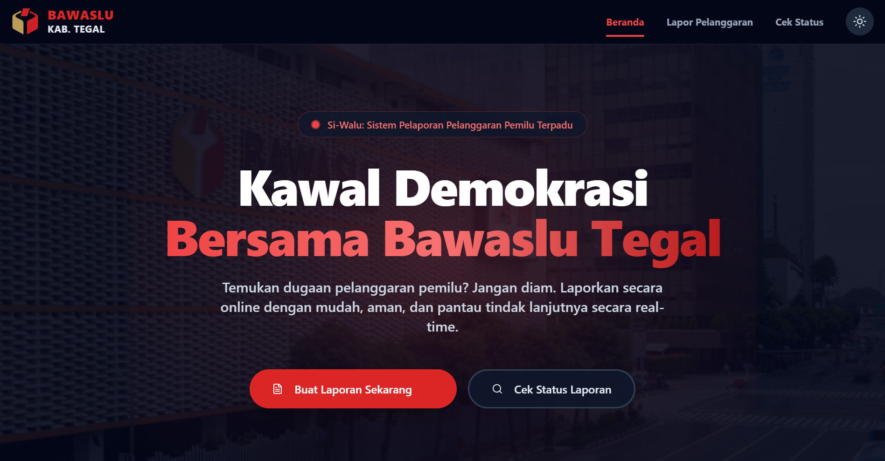

# 🦅 Si-Walu: Sistem Pelaporan Pelanggaran Pemilu Terpadu

**Si-Walu** (Sistem Informasi Bawaslu) adalah platform digital berbasis web yang dirancang khusus untuk memfasilitasi masyarakat **Kabupaten Tegal** dalam melaporkan dugaan pelanggaran pemilu secara aman, transparan, dan *real-time*.

---

## 📸 Tampilan Utama


---

## ✨ Fitur Utama

-   **🗳️ Pelaporan Mandiri**: Form laporan interaktif bagi warga untuk mengunggah deskripsi kejadian dan bukti multi-format (Gambar, PDF, Video).
-   **🎫 Sistem Tiket Otomatis**: Setiap laporan mendapatkan nomor tiket unik (Contoh: `BWS-TGL-2026-X8Y2Z`) untuk pelacakan status.
-   **📧 Notifikasi Email (SMTP)**: Integrasi otomatis dengan Gmail SMTP untuk mengirim bukti lapor dan pembaruan status ke email pelapor.
-   **📊 Statistik Transparansi**: Visualisasi data laporan (Masuk, Verifikasi, Proses, Selesai) yang sinkron langsung dari database di halaman beranda.
-   **🔐 Role-Based Access Control (RBAC)**: Pembatasan hak akses ketat menggunakan sistem Role:
    -   **Super Admin**: Akses penuh, manajemen akun staf, dan konfigurasi sistem.
    -   **Pimpinan**: Akses peninjauan laporan (Read-only).
    -   **Operator**: Manajemen harian laporan dan pembaruan status tiket.
-   **⚙️ Panel Pengaturan**: Admin dapat mengelola profil instansi dan mengontrol fitur notifikasi secara dinamis.

---

## 🛠️ Arsitektur Teknologi

Proyek ini dibangun dengan arsitektur **Decoupled (Headless)**:

| Layer | Teknologi |
| --- | --- |
| **Frontend** | [Next.js 14](https://nextjs.org/) (App Router), Tailwind CSS, Shadcn UI |
| **Backend** | [Laravel 11](https://laravel.com/) (RESTful API), Sanctum Auth |
| **Database** | MySQL / MariaDB |
| **Icons** | Lucide React |

---

## 🚀 Panduan Instalasi

### 1. Kloning Repositori
```bash
git clone https://github.com/AdnNyx/PelaporanPelanggaran.git
```
```bash
cd PelaporanPelanggaran
```
### 2. Konfigurasi Backend (Laravel)
```Bash
cd backend
```
```
composer install
```
```
cp .env.example .env
```
```
php artisan key:generate
```
```
php artisan storage:link
```
Buka file .env dan atur konfigurasi database serta kredensial SMTP Gmail.

**Migrasi & Admin Default:**

```Bash
php artisan migrate --seed
```
```
php artisan serve
```
### 3. Konfigurasi Frontend (Next.js)
```Bash
cd ../frontend
npm install
npm run dev
```
Buka http://localhost:3000 di browser Anda.

## 🔑 Kredensial Login Default
Gunakan akun berikut untuk pengujian awal (Super Admin):

Email: admin@bawaslu.go.id

Password: password123

## 📂 Struktur Proyek
```Plaintext
├── backend/                # Laravel Framework
│   ├── app/Http/Controllers/Api/  # Auth & Report Logic
│   ├── app/Models/                # Eloquent Models (User, Report, Evidence)
│   ├── database/migrations/       # Database Schema
│   └── routes/api.php             # REST API Routes
└── frontend/               # Next.js Framework
    ├── src/app/(admin)/           # Dashboard, Reports, Settings
    ├── src/app/(auth)/            # Login & Auth Pages
    ├── src/components/            # UI Components (Shadcn)
    └── src/hooks/                 # Custom React Hooks
```
## 🛡️ Keamanan & Privasi
Platform ini dirancang dengan prinsip enkripsi data modern. Identitas pelapor dilindungi oleh sistem dan hanya dapat diakses oleh petugas berwenang Bawaslu untuk keperluan klarifikasi internal.

## 👨‍💻 Developer
[AdnNyx](https://www.instagram.com/adn_nyx/)

